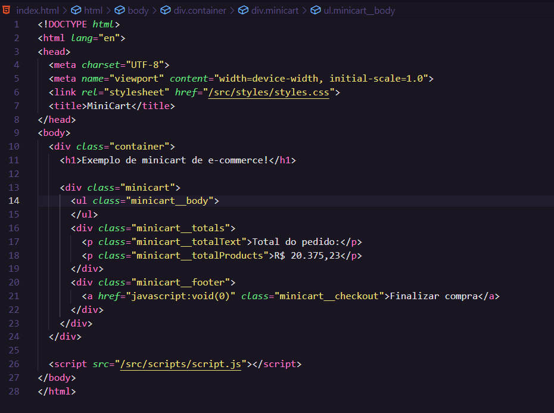

# Desafio Minicart

O desafio tem como objetivo testar seus conhecimentos proporcionando uma experiência real de um carrinho de compras de um e-commerce.

Aqui contém um minicart estilizado e com dados estáticos, o objetivo é que o carrinho fique dinâmico, e realize as somas dos produtos adicionados de acordo com suas respectivas quantidades. 

No objeto "Cart", você não precisa mexer, a não ser que seja para alterar o valor dos atributos "bestPrice, quantity"  e "available" para verificar suas condições de disponibilidade. Dito isso, bora para os objetivos propostos:

1 - Adicionar os produtos dinamicamente, e retirar do index.html as "lis".
OBS: Para isso, no JS você deve usar algum loop. (for, forEach, map etc...)
O código final deverá se parecer com esse: 

2 - Além de popular as "lis" dinamicamente, quero que todas as propriedades como "id", "alt da imagem", "nome do produto", "preço" e "quantidade", sejam preenchidos dinamicamente de acordo com os dados que constam no objeto "cart" no início do código.
OBS: Para isso, você pode utilizar o "Template String", para evitar colocar muitos sinais de + para concatenar.

3 - no "p" com a classe "minicart__totalProducts" deverá receber o valor da soma TOTAL dos itens no carrinho.
OBS: Lembre-se de filtrar os produtos disponíveis para a realização da soma. E para formatação do valor lembre-se também de toLocaleString(), é um método do JS.

Em resumo, você deve me fornecer o carrinho dinâmico, mostrando apenas os itens available=true, e com a soma dos valores de acordo com a quantidade dos produtos.

Qualquer dúvida, estarei a disposição.

